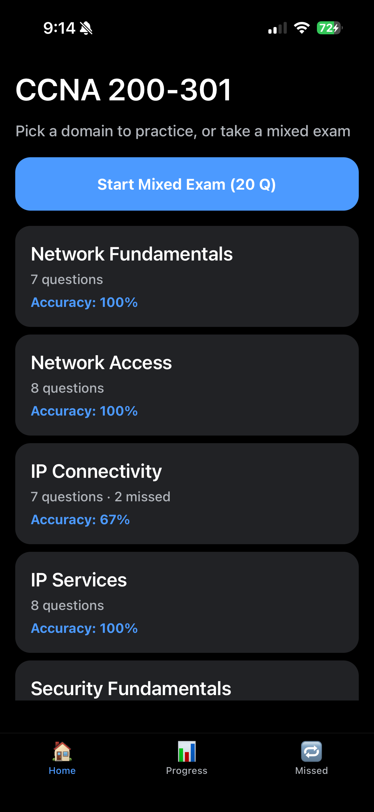
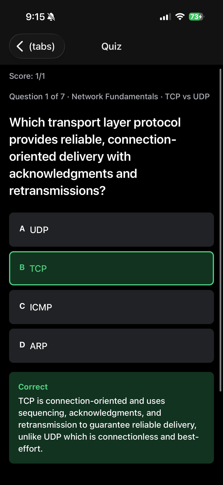

# CCNA Study App

A React Native (Expo) app for studying CCNA 200-301 v1.1 exam topics: Network Fundamentals, Network Access, IP Connectivity, IP Services, Security Fundamentals, and Automation and Programmability.

## Screenshots



## Features

- Practice by domain, or take a mixed 20-question exam sampled evenly across all domains
- Multiple-choice questions with an explanation shown after each answer
- Score tracking broken down by curriculum domain
- Missed-question review list, auto-cleared when you answer correctly again
- All progress stored locally on-device (no account, no backend)

## Tech stack

- Expo SDK 54 + Expo Router (file-based routing)
- TypeScript (strict)
- Zustand for state, with `persist` backed by AsyncStorage
- Question bank stored as JSON files under `src/data/questions/`, one per domain

## Getting started

```bash
npm install
npx expo start
```

Scan the QR code with Expo Go on a physical device, or press `i` / `a` for the iOS Simulator / Android Emulator, or `w` for a web preview.

## Adding questions

Each domain's question bank lives in `src/data/questions/<domain>.json` as an array of objects:

```json
{
  "id": "ip-connectivity-001",
  "domain": "IP Connectivity",
  "objective": "3.1",
  "topic": "Routing Table",
  "difficulty": "medium",
  "question": "Which route will a router select when multiple routes match the destination?",
  "choices": ["The route with the lowest metric", "The route with the longest prefix match", "The oldest route", "The route learned through OSPF"],
  "correctAnswer": 1,
  "explanation": "Routers first select the route with the longest matching prefix.",
  "tags": ["routing", "longest-prefix-match"]
}
```

Adding a question is just appending to the relevant file — no other code changes required. A dev-time validator (`src/data/questionLoader.ts`) checks each question bank on app start and logs any malformed entries to the console.
